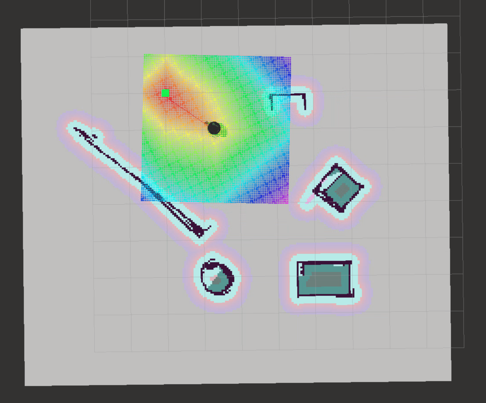

[](https://www.udacity.com/robotics)

# udacity-robond-p5

**Home Service Robot - Final project of the Udacity Robotics Software Engineer Nanodegree**



## Description

This project contains a home service robot capable of executing simultaneous localization and mapping (SLAM), as well as navigating to goal points to pick up/drop off objects.

## Concepts

Concepts explored in this project:

* Gmapping RGB-D SLAM
* Uniform Cost Search and ROS navigation stack
* Adaptive Monte Carlo Localization (http://wiki.ros.org/amcl)


## Getting Started

To get started, you need to have **ROS-Kinetic** installed on LInux.

First, create your own catkin workspace and clone this repository under `src`  folder

```shell
$ mkdir -p catkin_ws/src && cd catkin_ws/src
$ catkin_init_workspace
```

Next, compile all the ROS packages under the root directory: 

```shell
$ catkin_make
$ source devel/setup.bash
```

And navigate to the `scripts` directory:

```shell
$ cd src/scripts
```

### Part 1: SLAM

The first thing the robot can do is simultaneous localization and mapping (SLAM). To perform SLAM, run the `test_slam.sh`script:

```shell
$ ./test_slam.sh
```

Several windows will automatically open (this may take a few seconds). You will see the robot in Rviz in what looks like a fairly blank map. To operate the robot, click on the window for the `keyboard_teleop` node, and follow the commands there. As the robot moves around the world, the map will begin to appear in Rviz.

### Part 2: Navigation

The next task for the robot is navigation. To test the robot's navigation capabilities, run the `test_navigation.sh` script:

```shell
$ ./test_navigation.sh
```

Again, several windows will open (this may take a few seconds). This time you'll see the robot in a completed map in Rviz. Click the "2D Nav Goal" button and click/drag somewhere on the map to command the robot. The robot will find a path to the goal location and follow it.

### Part 3: Full Service

Now that the world is mapped and the robot can follow commands, the robot can be instructed to pick up and drop off a simulated object at different waypoints. To do this, run the `home_service.sh` script:

```shell
$ ./home_service.sh
```

An item (represented by a green cube) will show up in Rviz. The robot will navigate to the item, at which point it will disappear (indicating it has been picked up), and then the robot will navigate to another point and drop off the item, at which point the item will reappear.

## Notice 

- Notice that in each shell executables file, we copied `dwa_local_planner_params.yaml` to replace the original one provided by `turtlebot_navigation` package to prevent robot rotating behavior.  The original file in my case is at this path: `/opt/ros/kinetic/share/turtlebot_navigation/param/dwa_local_planner_params.yaml`

  The specific parameters changes are shown as below:

  ```yaml
    max_trans_vel: 0.3 # choose slightly less than the base's capability
    min_trans_vel: 0.1  # this is the min trans velocity when there is negligible rotational velocity
    trans_stopped_vel: 0.1
  
    # Warning!
    #   do not set min_trans_vel to 0.0 otherwise dwa will always think translational velocities
    #   are non-negligible and small in place rotational velocities will be created.
  
    max_rot_vel: 0.5  # choose slightly less than the base's capability
    min_rot_vel: 0.4  # this is the min angular velocity when there is negligible translational velocity
    rot_stopped_vel: 0.3
  ```

- The map **absolute path** is provided as an argument in the shell files. You **need to change it depending on your workspace path** to read the map and use it for amcl localization.

   ```shell
  xterm -e "roslaunch turtlebot_gazebo amcl_demo.launch map_file:=${PATH_TO_YOUR_CATKIN_WS}/src/udacity-robond-p5/map/map.yaml" &
   ```

  

## Behavior

 

### Watch The Video

[](http://www.youtube.com/watch?v=00jgy8y_vRs "")

